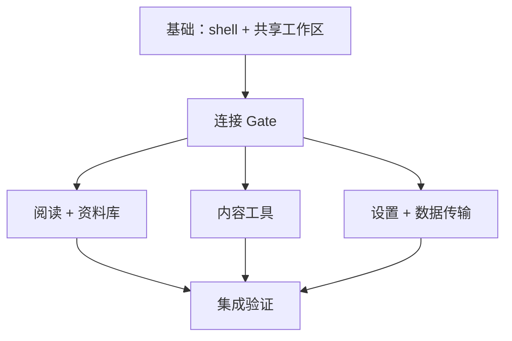

# Gist 桌面端 — 统一实施计划

- 状态：已批准
- 来源：`CAPABILITY-MAP.md` 和全部八份已批准的 `SPEC-*.md` 文件
- 审批后的任务目标：GitHub Issues（仓库指定的任务跟踪器）

## 1. 目标

在保留现有 Web/PWA 产品的同时，以小型、可测试的切片实施已批准的 Gist 桌面客户端。本计划涵盖：

1. `desktop-shell`
2. `reader-workspace`
3. `connection`
4. `reading`
5. `library`
6. `content-tools`
7. `settings-profile`
8. `data-transfer`

`specs-eli5.html` 和 `tasks-plan-eli5.html` 是临时的本地说明产物。它们不是需求来源，不属于本计划，也不得提交。

## 2. 固定实施边界

- 将 Wails Go/CLI 固定为 `v3.0.0-beta.12`。仅在生成的绑定需要时引入 `@wailsio/runtime`，届时将该 npm 包固定为 `3.0.0-beta.12`。
- 复用现有 React UI、hook、store、API 客户端、样式和后端分层。
- Gist 服务端保持独立部署。桌面应用仅作为客户端。
- 保持现有 Web/PWA 构建和行为不变。
- 每次行为变更都要添加测试；不得创建仅供测试使用的实现路径。
- 除非已批准的 Spec 明确要求，否则不得添加传输框架、服务注册表、窗口管理器、设置框架、任务中心、离线层、迁移、生产依赖或防御性安全机制。
- 共享文件冲突通过串行调度相关任务解决，不复制代码，也不臆造抽象层。

## 3. 依赖关系图

默认执行顺序：

| 阶段 | 工作 | 并行方式 |
| --- | --- | --- |
| 1 | `FND-01 → FND-02 → FND-03 → FND-05`，同时执行 `FND-04` | 前端/原生 shell 链与共享工作区提取可并行执行。 |
| 2 | `CON-01` 至 `CON-11` | 生成绑定后，`CON-06` 和 `CON-07` 可重叠执行；其他重叠均遵循显式依赖关系。 |
| 3 | 阅读、资料库、内容工具、设置和数据传输工作线 | `CON-11` 完成后，五条能力工作线可并行执行；下述共享文件所有权仍然适用。 |
| 4 | `INT-01`，然后执行 `INT-02-WIN` / `INT-02-MAC` / `INT-02-LINUX` | 当前平台回归测试先于三个并行的原生平台准入验证。 |

## 4. 共享文件协调

以下是调度约束，不能作为引入新抽象的理由：

| 共享区域 | 串行所有权顺序 |
| --- | --- |
| `desktop/main.go` | `FND-03` → `CON-04` → `READ-08` → `CT-07` → `DT-06`；这些边也编码为任务依赖。 |
| 生成的 `frontend/bindings/**` | `CON-04` → `READ-08` → `DT-06`；`CT-07` 使用 Wails Stream 注册，不拥有生成的服务绑定。 |
| `frontend/src/api/index.ts` | `CON-06` → `READ-07` → `CT-06` → `CT-08` → `SP-06` → `SP-08` → `DT-03` → `DT-05`/`DT-07`；同一时间只能有一个任务负责编辑。 |
| `frontend/src/stores/auth-store.ts` | `CON-08`/`CON-11` → `SP-02` → `CT-12`；后一个依赖关系已明确声明。 |
| `frontend/src/components/settings/tabs/DataControl.tsx` | `DT-04` → `SP-10` → `CT-13`；Web/桌面端的导出差异继续封装在适配器后，不再重新修改此组件。 |
| `backend/internal/handler/entry_handler.go` | `READ-06` → `CT-01`；该依赖关系已明确声明。 |
| 共享的设置后端文件 | `SP-05 → SP-07`；该依赖关系已明确声明。 |
| `frontend/src/types/api.ts` 和 locale 文件 | 同一时间只分配一个活动任务；不得仅为并行而拆分或复制这些文件。 |

## 5. 任务目录

每项任务均可在一次专注工作中完成。`S` 表示小范围变更；`M` 表示完整但边界明确的纵向切片。

### 基础

#### FND-01 — 添加最小化桌面端 React 入口（`S`）

- **结果：** 添加仅供桌面端使用的 HTML 和 React 入口，渲染一个小型资源加载探针，而非产品工作区。
- **验收标准：** 该入口无需启动 `App`、导入 `UpdateNotice`、注册/清除 Service Worker 或发起 Gist API 请求即可渲染；共享 CSS 仍是唯一的样式来源。
- **验证：** `cd frontend && bun run test -- src/desktop/DesktopShell.test.tsx`。
- **依赖：** 无。
- **可能涉及的文件：** `frontend/desktop/index.html`、`frontend/src/desktop/main.tsx`、`DesktopShell.tsx`、`DesktopShell.test.tsx`。

#### FND-02 — 添加桌面端 Vite 构建和资源防护检查（`M`）

- **结果：** 为最小化入口添加桌面端 Vite 配置、package 脚本和构建后验证器。
- **验收标准：** `build:desktop` 生成 `desktop/frontend/dist/index.html`；输出不含 manifest、Service Worker、Workbox、其他复制的 PWA 公共资源或更新提示；存在这些文件时验证器失败；Web `bun run build` 保持不变。
- **验证：** `cd frontend && bun run build:desktop && bun run verify:desktop-assets && bun run build`。
- **依赖：** `FND-01`。
- **可能涉及的文件：** `frontend/vite.desktop.config.ts`、`package.json`、`tsconfig.node.json`、`scripts/verify-desktop-assets.ts`。

**基础检查点 A：** `FND-01` 和 `FND-02` 通过各自的专项测试/构建；桌面端输出存在且不含 PWA 内容；Web 仍可构建。

#### FND-03 — 创建固定版本的原生 Wails shell（`M`）

- **结果：** 创建独立的桌面端 Go 模块，以及一个嵌入生成前端资源的原生 `Gist` 主窗口。
- **验收标准：** 安装/使用 `wails3@v3.0.0-beta.12`；`go.mod` 将 Wails 固定为 `v3.0.0-beta.12`；可调整大小的原生窗口以 `1440×900` 居中打开；关闭主窗口时进程退出；不保留示例服务。
- **验证：** `go install github.com/wailsapp/wails/v3/cmd/wails3@v3.0.0-beta.12`；然后运行 `cd desktop && wails3 version && go fmt ./... && go vet ./... && go test ./... && go run .`；手动确认只有一个居中、可调整大小的 `1440×900` 原生窗口，并确认关闭主窗口时进程退出。
- **依赖：** `FND-02`（`go:embed` 目标必须存在）。
- **可能涉及的文件：** `desktop/go.mod`、`desktop/go.sum`、`desktop/main.go`、最少量的 embed/build 元数据。

#### FND-04 — 提取共享 ReaderWorkspace（`M`）

- **结果：** 将认证后的阅读器组合结构从 `App.tsx` 机械迁移到零参数的共享 `ReaderWorkspace`。
- **验收标准：** Web 的认证/加载/错误/更新分支仍留在 `App.tsx`；Web 认证后的渲染使用 `ReaderWorkspace`；路由、Query key、hook、store、响应式断点、portal 层级、滚动规则和样式均不变；不新增桌面端/API 抽象。
- **验证：** `cd frontend && bun run test -- src/App.test.tsx src/components/reader-workspace/ReaderWorkspace.test.tsx src/app-shell.test.ts && bun run lint && bun run build`。
- **依赖：** 无；可与 `FND-01` 至 `FND-03` 并行执行。
- **可能涉及的文件：** `App.tsx`、`App.test.tsx`、`components/reader-workspace/{ReaderWorkspace,index}.tsx`、工作区测试、`app-shell.test.ts`。

**基础检查点 B：** 在 `1440`、`1024` 和 `390` px 下，Web 认证和完整阅读器工作区保持现有布局、路由、滚动行为及交互入口不变。

#### FND-05 — 将 Wails dev/build 接入现有前端（`M`）

- **结果：** 配置桌面端 Taskfile/构建元数据，以运行仓库级 Bun 前端并嵌入其输出。
- **验收标准：** `wails3 dev` 提供热重载并创建一个窗口；`wails3 build` 嵌入资源；无需第二条 Vite 命令；只保留 Windows/macOS/Linux 桌面端任务；不改动 Web/Docker 路径。
- **验证：** `cd desktop && wails3 doctor && wails3 build && wails3 dev`；手动确认窗口初始大小为 `1440×900`、居中且可调整大小，并确认热重载、单窗口，以及关闭主窗口时进程退出；随后在没有 Vite 或 Gist 服务的情况下启动构建出的二进制文件。
- **依赖：** `FND-03`。
- **可能涉及的文件：** `desktop/Taskfile.yml`、`desktop/build/Taskfile.yml`、`desktop/build/config.yml`、所需的平台构建资源。

**基础阶段准出条件：** `FND-04` 和 `FND-05` 已完成；完整前端测试、lint 和 Web 构建通过；桌面端格式化、vet、测试和构建在当前平台通过；未改动任何后端或 Docker 文件。

### 连接

#### CON-01 — 实现运行时连接状态（`M`）

- **结果：** 添加一个具体的 `ConnectionService`，在内存中管理规范化的服务 URL 和 Token。
- **验收标准：** `Configure` 只接受 host 非空的绝对 HTTP(S) URL，保留合法的 base path，并拒绝 userinfo、query 和 fragment，而不是改写它们；不存储任何文件/keyring 状态；配置前，`SetToken` 拒绝非空 Token；`Clear` 删除这两个值且具备幂等性；本任务不调用 `/api/auth/status`，也不引入握手/实例/多连接概念。
- **验证：** `cd desktop && go test ./... -run 'Connection|Configure|SetToken|Clear|Normalize'`。
- **依赖：** `FND-03`。
- **可能涉及的文件：** `desktop/connection.go`、`desktop/connection_test.go`。

#### CON-02 — 代理精确路由和有限响应（`M`）

- **结果：** 让资源中间件仅处理 `/api`、`/api/**`、`/icons` 和 `/icons/**`。
- **验收标准：** 其他资源路径继续向后传递；保留 HTTP 方法、规范化的 base-path 拼接、查询参数、有限的请求体/响应体、状态码和相关 content header；上游 `Host` 为目标 host；缺少配置时返回 `503 connection_not_configured`；传输失败时返回 `502 connection_unavailable`；上游 `401/422/500/503` 保持不变。
- **验证：** `cd desktop && go test ./... -run 'Proxy|Route|BasePath|NotConfigured|Unavailable|UpstreamStatus'`，使用确定性的 `httptest.Server` 用例。
- **依赖：** `CON-01`。
- **可能涉及的文件：** `desktop/connection_proxy.go`、`desktop/connection_proxy_test.go`。

#### CON-03 — 强制执行代理的 Token、cookie、缓存和图片语义（`M`）

- **结果：** 完成已批准的请求 header 和受保护资源行为，但不宣称支持流式传输。
- **验收标准：** 当前 Go Token 非空时替换 renderer Authorization；Go Token 为空时删除所有 renderer Authorization；删除 WebView `Cookie` 和上游 `Set-Cookie`；GET/HEAD 丢弃 `If-None-Match` 和 `If-Modified-Since`，写请求则保留它们；图标和 `/api/proxy/image` 可正常工作；切换已配置的服务会影响下一次请求；SSE/NDJSON 渐进式传输明确不属于此代理契约。
- **验证：** `cd desktop && go test ./... -run 'Proxy|Token|Cookie|Conditional|Icon|Image|Switch'`。
- **依赖：** `CON-02`。
- **可能涉及的文件：** `desktop/connection_proxy.go`、`desktop/connection_proxy_test.go`。

**连接检查点 A：** `CON-01` 至 `CON-03` 通过 Go 测试；URL 状态和有限代理行为符合 Spec；未改动任何后端文件。

#### CON-04 — 注册一个服务实例并生成绑定（`M`）

- **结果：** 向 Wails 和代理注册同一个具体的 ConnectionService 实例，然后生成并提交 TypeScript 绑定。
- **验收标准：** 绑定和代理共享运行时状态；输出生成至 `frontend/bindings/`；绝不手动编辑生成的文件；仅当生成的代码需要时，才在本任务中引入 `@wailsio/runtime`，且版本必须精确为 `3.0.0-beta.12`。
- **验证：** `cd desktop && wails3 generate bindings -d ../frontend/bindings -clean=true -ts && go test ./...`；检查 `git diff -- frontend/bindings frontend/package.json frontend/bun.lock`。
- **依赖：** `CON-03`、`FND-05`。
- **可能涉及的文件：** `desktop/main.go`、`frontend/bindings/**`、`frontend/package.json`、`frontend/bun.lock`。

#### CON-05 — 在 dev/build 中自动生成绑定并处理连接资源（`M`）

- **结果：** 让桌面端 dev/build 重新生成绑定，并且只包含现有品牌 logo。
- **验收标准：** 两条 Wails 命令都在运行前端前生成绑定；桌面端 `VITE_API_URL` 为空；Web 构建既不生成绑定，也不依赖 Go；桌面端输出包含 `logo.svg`，且仍不含 PWA 内容。
- **验证：** `(cd frontend && bun run build && bun run build:desktop && bun run verify:desktop-assets)`；然后运行 `(cd desktop && wails3 build && wails3 dev)`，观察绑定在桌面端前端启动前生成，并在窗口打开后停止 dev 进程。
- **依赖：** `CON-04`。
- **可能涉及的文件：** 桌面端 Taskfile/config、`frontend/package.json`、`frontend/scripts/verify-desktop-assets.ts`。

**连接检查点 B：** 绑定与已注册的服务一致；Web 和桌面端构建通过；桌面端 logo 存在；没有 PWA 资源进入桌面端输出。

#### CON-06 — 添加基于 Promise 的 Token 和 API 错误契约（`M`）

- **结果：** 定义一个基于 Promise 的 Token 同步 hook、异步未授权回调、可选的 `ApiError.code`，并在现有 API 边界识别连接错误。
- **验收标准：** helper/callback 契约始终为异步；Web 不注册桌面端同步器；status/register/login/logout 不触发全局 `401`；其他显式 `401` 调用该回调；`connection_unavailable` 保持独立；持久化 Token 时先同步 Go，若 localStorage 失败，则尝试恢复旧的 Go Token，再重新抛出原始存储错误。调用点迁移由 `CON-08` 负责。
- **验证：** `cd frontend && bun run test -- src/api/index.test.ts src/lib/errors.test.ts`。
- **依赖：** `CON-05`。
- **可能涉及的文件：** `frontend/src/api/index.ts`、`frontend/src/api/index.test.ts`、`frontend/src/lib/errors.ts`、`frontend/src/lib/errors.test.ts`。

#### CON-07 — 添加具体的 Wails 运行时和地址存储适配器（`S`）

- **结果：** 只封装生成的 ConnectionService 调用和 `gist_service_url` localStorage key。
- **验收标准：** 适配器方法与 Configure/SetToken/Clear 一一对应；存储只往返读写一个地址，暴露写入失败，且不新增通用 host 接口、连接注册表、缓存 namespace 或 config 文件。
- **验证：** `cd frontend && bun run test -- src/desktop/connection-runtime.test.ts src/desktop/connection-storage.test.ts`。
- **依赖：** `CON-05`；可与 `CON-06` 并行执行。
- **可能涉及的文件：** `connection-runtime.ts`、`connection-storage.ts` 及其测试。

**连接检查点 C：** `CON-06` 和 `CON-07` 验证了经过 await 的 Token/错误契约、精确的生成绑定适配器、单一地址 key、存储回滚，以及不变的 Web 行为。

#### CON-08 — 将认证迁移到可等待的生命周期（`M`）

- **结果：** 在 Gate 使用这些调用点前，将现有 Web 登录/注册、桌面端登录、退出、`401` 和密码 Token 调用点迁移到统一的可等待 helper。
- **验收标准：** Web 登录/注册和桌面端登录都会等待 Token 同步完成；仅桌面端入口禁用远程 cookie 退出，Web 保留该行为；退出/`401` 先发布未认证状态并取消 Query 请求，再清除 Token，最后清除 QueryClient；绑定错误保留诊断信息，绝不阻碍本地清理；网络失败时保留 Token；`ProfileSettings` 机械地等待该 helper 完成（完整的密码失败 UX 仍由 `SP-02` 负责）。
- **验证：** `cd frontend && bun run test -- src/stores/auth-store.test.ts src/api/index.test.ts src/components/settings/tabs/ProfileSettings.test.tsx`。
- **依赖：** `CON-06`、`CON-07`。
- **可能涉及的文件：** `auth-store.ts`/测试、`api/index.ts` 测试、`ProfileSettings.tsx`/测试。

#### CON-09 — 构建展示型 ConnectionPage（`S`）

- **结果：** 添加仅供桌面端使用的单地址表单和精确的错误呈现，将编排留给 Gate。
- **验收标准：** 页面渲染一个 URL 字段及提交/重试状态；无效、不可达和未初始化消息可见；`exists:false` 引导用户通过 Web 完成初始化，绝不渲染 RegisterPage；页面自身不调用 Configure/status，也不保存地址。
- **验证：** `cd frontend && bun run test -- src/desktop/ConnectionPage.test.tsx`。
- **依赖：** `CON-08`。
- **可能涉及的文件：** `ConnectionPage.tsx`、其测试，以及仅在缺少已批准文案时涉及的 locale 文件。

#### CON-10 — 在 Gate 中实现首次连接和启动恢复（`M`）

- **结果：** 添加 `DesktopConnectionGate`，并通过现有 ReaderWorkspace 所需的各个 provider 挂载它。
- **验收标准：** 没有已保存地址时，先清除孤立的 `gist_auth_token` 和 Go 运行时状态，再显示 ConnectionPage；新地址流程为 `Configure → /api/auth/status → 保存地址`；仅 `exists:true` 时继续；启动流程为 `加载地址/Token → 等待 Configure 完成 → status → 仅在 Token 存在时调用 auth/me`；Configure 失败时不发起 API 请求；只有显式 `401` 清除 Token，网络/5xx/格式错误响应会保留 Token；使用 Router、QueryClient、i18n、Tooltip、共享 CSS 和 `.app-shell` 承载工作区。
- **验证：** `cd frontend && bun run test -- src/desktop/DesktopConnectionGate.test.tsx src/desktop/ConnectionPage.test.tsx src/desktop/connection-storage.test.ts src/stores/auth-store.test.ts`。
- **依赖：** `CON-08`、`CON-09`、`FND-04`。
- **可能涉及的文件：** `DesktopConnectionGate.tsx`/测试、桌面端 `main.tsx`、`LoginPage.tsx`、`NetworkErrorPage.tsx`。

**连接检查点 D：** `CON-08` 至 `CON-10` 覆盖经过 await 的 Web/桌面端认证、首次连接、孤立 Token 清理、无效/不可达/未初始化服务、登录转换、重启恢复、格式错误/5xx 状态、重试和更改地址入口。

#### CON-11 — 完成更换服务时的清理（`M`）

- **结果：** 仅为单连接模型实现显式的“更换服务”状态转换。
- **验收标准：** 先卸载已认证 UI/取消请求，再清除 auth、Token、Query 数据、已保存 URL 和 Go 状态，随后返回 ConnectionPage；绑定错误保留诊断信息，但不能遗留旧的本地状态；转换后绝不闪现旧服务数据。
- **验证：** `(cd frontend && bun run test -- src/desktop/DesktopConnectionGate.test.tsx src/stores/auth-store.test.ts src/desktop/connection-storage.test.ts)`；然后运行 `(cd desktop && go fmt ./... && go vet ./... && go test ./... && wails3 build)`。
- **依赖：** `CON-10`。
- **可能涉及的文件：** Gate/测试、auth store/测试、connection storage；仅在需要时涉及现有 QueryClient 模块。

**连接阶段准出条件：** 运行 `(cd frontend && bun run lint && bun run test && bun run build && bun run build:desktop && bun run verify:desktop-assets)`，然后运行 `(cd desktop && go fmt ./... && go vet ./... && go test ./... && wails3 build)`。在当前原生平台覆盖登录、重启、退出、`401`、网络恢复和更换服务。`CON-11` 完成后，解除下方所有业务能力的阻塞。

### 阅读

#### READ-01 — 保持路由、导航、未读计数与刷新监听 (`M`)

- **结果：** 在不重新设计的前提下，通过桌面代理打通现有导航/选择路径。
- **验收标准：** Feed/folder/type/starred 路由及查询参数映射到当前选择；导航和未读计数保持正确；15 秒刷新监听器不会在首次快照时触发失效，且仅在时间戳变化时准确使 `entries`、`unreadCounts` 和 `feeds` 失效；不新增第二个监听器。
- **验证：** `cd frontend && bun run test -- src/lib/router.test.ts src/hooks/useSelection.test.ts src/hooks/useRefreshStatus.test.tsx`。
- **依赖：** `CON-11`、`FND-04`。
- **可能涉及的文件：** router/selection 辅助函数及测试、`useRefreshStatus.ts`/test。

#### READ-02 — 保持列表分页、去重与滚动状态 (`M`)

- **结果：** 保持现有三种列表类型及增量加载行为。
- **验收标准：** 每页请求 50 项；下一页 offset 使用实际已加载数量；跨页 ID 去重；保留空、加载中和已到底状态；恢复各选择项对应的滚动位置，且不会泄漏到其他列表。
- **验证：** `cd frontend && bun run test -- src/lib/entry-pagination.test.ts src/components/entry-list/EntryList.test.tsx`。
- **依赖：** `READ-01`。
- **可能涉及的文件：** pagination 辅助函数/test、EntryList/test；仅当针对性故障确有需要时，才涉及现有列表滚动 store。

#### READ-03 — 保持条目资源与图片交互 (`M`)

- **结果：** 使用同一套 UI，完成 Web 和桌面端的选中条目/资源展示。
- **验收标准：** 条目正文、Feed 图标、经代理加载的正文图片、图片瀑布流、Lightbox、ImagePreview、普通/图片布局及现有错误处理均可通过相对路由正常工作；不引入资源适配器，也不另复制一套 UI。
- **验证：** `cd frontend && bun run test -- src/components/entry-content/EntryContentBody.test.tsx src/components/picture-masonry/PictureMasonry.test.tsx src/components/picture-masonry/Lightbox.test.tsx src/components/ui/image-preview.test.tsx`。
- **依赖：** `READ-02`。
- **可能涉及的文件：** EntryContentBody/test、PictureMasonry/test、Lightbox/test、image-preview test/最小修复。

**阅读检查点 A：** 在当前桌面构建上，`READ-01` 至 `READ-03` 通过导航、刷新失效、分页/去重/滚动、条目资源和图片交互测试。

#### READ-04 — 保持自动及批量标记已读的状态转换 (`M`)

- **结果：** 保持当前标记已读的时机、回滚和滚动补偿。
- **验收标准：** 打开详情时标记为已读；从未读列表移除条目时等待既定过渡完成；滚动批处理对 ID 去重；失败时恢复状态和位置；通过 Lightbox 查看时仍保留既有标记已读行为；成功变更仅使当前已批准的 Query 族缓存失效；不新增状态 UI。
- **验证：** `cd frontend && bun run test -- src/components/entry-list/EntryList.test.tsx src/components/entry-list/EntryListItem.test.tsx src/components/picture-masonry/Lightbox.test.tsx src/hooks/useEntries.test.ts`。
- **依赖：** `READ-03`。
- **可能涉及的文件：** EntryList/EntryListItem 及测试、`useEntries.ts`/聚焦测试；仅在需要时涉及 Lightbox 测试。

#### READ-05 — 保持加星标与取消星标的状态转换 (`S`)

- **结果：** 保持当前单条目的加星标/取消星标状态及缓存更新行为。
- **验收标准：** 加星标/取消星标可跨内容类型成功执行；失败时恢复先前状态；列表与详情保持一致；不新增星标计数/分组 UI。
- **验证：** `cd frontend && bun run test -- src/components/entry-list/EntryListItem.test.tsx src/hooks/useEntries.test.ts`。
- **依赖：** `READ-04`（明确交接 `useEntries.ts`）。
- **可能涉及的文件：** EntryListItem/test、`useEntries.ts`/聚焦测试。

**阅读检查点 B：** `READ-04` 和 `READ-05` 在不新增 UI 的情况下，验证标记已读的时机/批处理/回滚/滚动补偿，以及加星标/取消星标的成功与失败行为。

#### READ-06 — 在后端端到端实现仅对星标未读条目执行全部标为已读 (`M`)

- **结果：** 在 repository、service、handler、测试及生成的 mock 中加入一个贯穿全链路且编译安全的布尔标志；不留下不兼容的中间提交。
- **验收标准：** Starred（星标）视图仅更新所有内容类型中的星标未读行；非星标未读行保持不变；feed、folder 和 content-type 作用域维持现有优先级，`starredOnly` 仅在未提供这些作用域时生效，最终的无过滤全局分支仍位于最后；省略该字段或设为 false 时保持当前行为；保留 handler 验证/计数；mock 使用 `make gen`；不添加兼容性重载。
- **验证：** `cd backend && make gen && go test ./internal/handler ./internal/service ./internal/repository -run 'MarkAll|Starred'`。
- **依赖：** `CON-11`、`FND-04`。
- **可能涉及的文件：** entry handler/service/repository、聚焦测试，以及机械生成的 mock；由于接口必须保持可编译，这一纵向切片有意保持原子性。

#### READ-07 — 发送仅限星标条目的前端请求 (`S`)

- **结果：** 仅将现有 Starred（星标）选择映射到新请求字段。
- **验收标准：** 只有 Starred 发送 `starredOnly`；成功时准确使 `entries` 和 `unreadCounts` 失效；不凭空引入乐观回滚；其他全部标记调用保持不变。
- **验证：** `cd frontend && bun run test -- src/api/entries.test.ts src/lib/router.test.ts src/hooks/useEntries.test.ts src/hooks/useSelection.test.ts`。
- **依赖：** `READ-06`、`READ-05`（明确交接 API/type 和 `useEntries.ts`）。
- **可能涉及的文件：** `api/index.ts`、`types/api.ts`、`useEntries.ts`、聚焦测试。

**阅读检查点 C：** 后端生成/测试及前端请求测试证明，星标条目的全部标为已读操作仅更改星标未读条目，且只使两个已批准的 Query 组失效。

#### READ-08 — 添加一个 OriginalPageService (`M`)

- **结果：** 注册一个具体的 Wails 服务，用于创建、复用、聚焦、替换和关闭原生的原文页面窗口。
- **验收标准：** 最多存在一个原文页面窗口；新 URL 复用该窗口；输入必须是 host 非空的绝对 HTTP(S) URL；窗口带原生边框且可调整大小；关闭该窗口时主窗口继续运行，重新打开时会重建；关闭主窗口会退出全部窗口；该页面不接收任何 Gist 状态或 bindings。
- **验证：** `cd desktop && go test ./... -run 'OriginalPage|Window' && wails3 generate bindings -d ../frontend/bindings -clean=true -ts`。
- **依赖：** `CON-11`；在 `CON-04`/`CON-05` 之后由其负责 `desktop/main.go`。
- **可能涉及的文件：** `original_page.go`/test、`desktop/main.go`、生成的 bindings。

#### READ-09 — 拦截桌面端外部链接 (`S`)

- **结果：** 在不增加产品 UI 的情况下，将现有 `_blank` HTTP(S) 链接重定向到 OriginalPageService。
- **验收标准：** 有效的桌面端链接会打开/聚焦原文页面窗口，主窗口不发生导航；非链接或非 HTTP(S) 内容不调用 binding；binding 失败时保留当前路由并记录诊断日志；Web 保留 `_blank`；内部路由保持不变；不新增标签页/分屏/工具栏/历史记录/管理器。
- **验证：** `cd frontend && bun run test -- src/desktop/DesktopOriginalLinks.test.tsx && bun run build && bun run build:desktop`。
- **依赖：** `READ-08`、`FND-04`。
- **可能涉及的文件：** DesktopOriginalLinks/test 及桌面端组合入口。

**阅读退出门槛：** 运行 `cd backend && make gen && make test && make lint`、`cd frontend && bun run lint && bun run test && bun run build && bun run build:desktop && bun run verify:desktop-assets` 和 `cd desktop && go fmt ./... && go vet ./... && go test ./... && wails3 build`；然后在当前平台覆盖阅读功能的所有成功标准及原文页面窗口生命周期。

### 资料库

#### LIB-01 — 保持 URL 规范化与 Feed 预览 (`M`)

- **结果：** 在 Web 和桌面端保持 AddFeedPage 前半部分不变。
- **验收标准：** URL 缺少协议时补为 HTTPS，`feed://` 转为 HTTPS；预览保留当前加载中/数据/错误状态，并与最终添加请求相互独立；预览中的站点链接保留 `target="_blank"`；资料库不安装第二个桌面端链接处理器。
- **验证：** `cd frontend && bun run test -- src/lib/url.test.ts src/hooks/useAddFeed.test.tsx src/components/add-feed/AddFeedPage.test.tsx`。
- **依赖：** `CON-11`、`FND-04`；在保留与阅读功能共用的 `_blank` 拦截入口前提下，可并行进行。
- **可能涉及的文件：** URL 辅助函数/test、`useAddFeed.ts`/test 的预览部分、AddFeedPage 测试。

#### LIB-02 — 完成 Feed 订阅及可选文件夹创建 (`M`)

- **结果：** 保持 AddFeedPage 后半部分及其确切的成功/失败副作用。
- **验收标准：** 为重复项错误 `409 feed_exists` 显示本地化文案；用户可选择无文件夹、现有文件夹或新文件夹；现有文件夹决定 type；先创建新文件夹，即使添加 Feed 失败也予以保留；成功后返回来源 type 的 All（全部）视图，并使 `feeds/entries/unreadCounts` 失效，仅在创建了文件夹时再使 `folders` 失效。
- **验证：** `cd frontend && bun run test -- src/hooks/useAddFeed.test.tsx src/components/add-feed/AddFeedPage.test.tsx`。
- **依赖：** `LIB-01`。
- **可能涉及的文件：** `useAddFeed.ts`/test 的添加部分、AddFeedPage/test；仅当当前提交接线需要时涉及 FeedPreviewCard。

**资料库检查点 A：** `LIB-01` 和 `LIB-02` 通过预览、`_blank`、重复项、文件夹选择、Feed 添加失败时保留文件夹、导航及精确失效测试。

#### LIB-03 — 保持 Feed 元数据编辑 (`S`)

- **结果：** EditFeedDialog 仅保留当前的标题和摘要提示词字段。
- **验收标准：** 去除首尾空白后的标题不能为空；摘要提示词允许清空，且最多包含 2000 个 Unicode 字符；URL 保持只读；成功时准确使 `feeds` 和 `entries` 失效；不向对话框添加文件夹选择器、复制、暂停或刷新控件。
- **验证：** `cd frontend && bun run test -- src/components/settings/tabs/EditFeedDialog.test.tsx src/hooks/useFeeds.test.tsx`。
- **依赖：** `LIB-02`（交接共用 feed hook/API）。
- **可能涉及的文件：** EditFeedDialog/test、`useFeeds.ts`/聚焦测试。

#### LIB-04 — 保持侧边栏中的文件夹移动功能 (`S`)

- **结果：** 保留 FeedItem/Sidebar 中实际存在的上下文操作，用于移入同类型文件夹或未分类位置。
- **验收标准：** Feed 只能移入同类型文件夹或未分类位置；保留当前上下文菜单；成功时准确使 `feeds` 和 `entries` 失效；EditFeedDialog 不增加文件夹选择器。
- **验证：** `cd frontend && bun run test -- src/components/sidebar/Sidebar.library.test.tsx src/hooks/useFeeds.test.tsx`。
- **依赖：** `LIB-03`（明确交接 `useFeeds.ts`）。
- **可能涉及的文件：** Sidebar/FeedItem、Sidebar 资料库测试、`useFeeds.ts`/聚焦测试。

**资料库检查点 B：** `LIB-03` 和 `LIB-04` 在真实 UI 入口验证元数据编辑、提示词约束、移入同类型文件夹/未分类位置，以及准确使两个 Query 族失效。

#### LIB-05 — 在后端将 type 已变更的 Feed 从文件夹中移出 (`M`)

- **结果：** 在不更改 endpoint 的前提下，修正现有单 Feed type 更新行为。
- **验收标准：** type 变更时，在同一次持久化更新中设置 `folder_id=NULL`；type 未变时保留文件夹；元数据/文章保持不变；更改文件夹 type 时，文件夹直接包含的 Feed 仍留在其中，同时变更 type；响应保持 `204`；不添加迁移或抽象。
- **验证：** `cd backend && go test ./internal/handler ./internal/service ./internal/repository -run 'Feed|Folder|Type'`。
- **依赖：** `CON-11`、`FND-04`。
- **可能涉及的文件：** feed service/repository 及聚焦测试；仅当现有请求路径不符合已批准的契约时才修改 handler。

#### LIB-06 — 保持“Refresh all”的所有结果分支 (`S`)

- **结果：** 保留设置中的“Refresh all”（全部刷新），且不增加其他监听器。
- **验收标准：** 加载中/禁用状态正常工作；成功时使 `feeds/entries/unreadCounts` 失效；并发 `409` 与普通失败保持可区分；各 Feed 的错误继续保存在 `errorMessage`；不接入单 Feed 刷新或第二个轮询器。
- **验证：** `(cd frontend && bun run test -- src/components/settings/tabs/FeedsSettings.test.tsx src/hooks/useFeeds.test.tsx)`；然后运行 `(cd backend && go test ./internal/handler ./internal/service -run Refresh)`。
- **依赖：** `LIB-04`（明确交接 `useFeeds.ts`）、`CON-11`。
- **可能涉及的文件：** FeedsSettings/test、`useFeeds.ts`/test；如有需要，涉及聚焦的后端刷新测试。

**资料库检查点 C：** `LIB-05` 和 `LIB-06` 验证 type 相同/变更时的持久化行为，以及刷新成功/`409`/失败时的精确失效行为。

#### LIB-07 — 在 type 变更时保持活动路由 (`M`)

- **结果：** 更改当前 feed/folder type 后，协调路由与 Query 状态。
- **验收标准：** 使用 replace 方式导航时只更改 type，同时保留当前对象 ID、条目 ID 和 `unread=true`；编辑其他对象时不导航；feed 使 `feeds/entries` 失效；folder 使 `folders/feeds/entries` 失效；不使 `unreadCounts` 失效。
- **验证：** `cd frontend && bun run test -- src/components/sidebar/Sidebar.library.test.tsx src/hooks/useFeeds.test.tsx src/hooks/useFolders.test.tsx src/lib/router.test.ts`。
- **依赖：** `LIB-05`、`LIB-06`（交接 feed/folder hook）。
- **可能涉及的文件：** Sidebar 资料库路由行为、feed/folder hook、router 辅助函数、聚焦测试。

#### LIB-08 — 协调删除当前选择后的状态 (`M`)

- **结果：** 从侧边栏或设置中删除活动 feed/folder 后，返回当前 type 的 All（全部）视图。
- **验收标准：** 成功时使 `feeds/folders/entries/unreadCounts` 失效；删除当前选择时使用 replace 方式导航，保留 `unread=true`，移除条目 ID，且不显示陈旧文章；删除其他对象时不导航；保留现有单个/批量/顶层文件夹语义；不增加确认操作。
- **验证：** `cd frontend && bun run test -- src/components/sidebar/Sidebar.library.test.tsx src/components/settings/tabs/FeedsSettings.test.tsx src/components/settings/tabs/FoldersSettings.test.tsx src/hooks/useFeeds.test.tsx src/hooks/useFolders.test.tsx`。
- **依赖：** `LIB-07`。
- **可能涉及的文件：** Sidebar/settings 删除入口及测试、feed/folder hook、当前选择/router 辅助函数。

**资料库退出门槛：** 运行 `SPEC-library.md` 中的全部命令；在当前桌面端手动覆盖预览/添加/编辑/移动/type 变更/删除/Refresh。不添加 OPML、AI 执行、离线数据、新文件夹 UI 或 Wails 服务。

### 内容工具

#### CT-01 — 验证后端 Readability 的抓取、缓存与取消 (`M`)

- **结果：** 让现有服务端抽取路径具有确定性，同时不改变其 API 形态。
- **验收标准：** 确定性测试覆盖 URL 抓取、抽取、持久化、第二次请求命中缓存、取消上游请求及错误；客户端不得自行构造 URL 或请求；保留现有 repository/cache 语义。
- **验证：** `cd backend && go test ./internal/service ./internal/handler -run Readability`。
- **依赖：** `CON-11`、`READ-06`（明确移交 entry handler）。
- **可能涉及的文件：** Readability service/test，以及仅在契约要求时修改 entry handler/test。

#### CT-02 — 完善前端 Readability 生命周期 (`M`)

- **结果：** 保留当前 UI，并让缓存显示、单次自动尝试、手动重试、取消及迟到结果隔离具有确定性。
- **验收标准：** 已缓存内容只切换显示状态；缺少 URL 时不发起请求；自动模式对每个已挂载条目只尝试一次，失败后不得循环；手动操作失败后可以重试；切换条目时忽略或取消旧响应；当前正文模式保持正确。
- **验证：** `cd frontend && bun run test -- src/hooks/useReadability.test.ts`。
- **依赖：** `CT-01`、`FND-04`。
- **可能涉及的文件：** `useReadability.ts`、其专项测试，以及必要时最小范围内的现有组合点。

**内容检查点 A：** `CT-01` 和 `CT-02` 通过后端与前端 Readability 测试，包括缓存命中、重试、取消、单次自动尝试和过期响应隔离。

#### CT-03 — 明确摘要的终止状态与缓存行为 (`M`)

- **结果：** 让摘要流记录和缓存写入能够区分增量、正常完成、失败与取消。
- **验收标准：** 摘要发出 `delta/done/error`；失败、取消或不完整的输出不得缓存；查询、提示词、生成和保存全程使用同一份目标语言快照；缓存响应与 Feed 提示词中的提醒保持兼容。
- **验证：** `cd backend && go test ./internal/handler ./internal/service ./internal/service/ai ./internal/repository -run 'Summary|AI'`。
- **依赖：** `CON-11`。
- **可能涉及的文件：** AI handler/service 的摘要路径及其专项测试/mock 更新。

#### CT-04 — 让详情翻译的终态要么完整、要么回退原文 (`M`)

- **结果：** 确保后端文章翻译仅在所有必需部分都完成后才报告成功。
- **验收标准：** 先发出原始正文块，翻译后的正文块继续渐进输出；只有所有正文块均成功后才发出 `done`；失败、取消或输出不完整时，不写入已完成的详情翻译缓存；整个请求使用同一份目标语言快照；结构化错误会结束操作；不得新增标题与正文合并端点、数据库事务或详情翻译缓存。
- **验证：** `cd backend && go test ./internal/handler ./internal/service ./internal/service/ai ./internal/repository -run 'Translate|Translation'`。
- **依赖：** `CT-03`（共享 AI handler/service 的明确移交）。
- **可能涉及的文件：** AI handler/service 的文章翻译路径及专项测试。

#### CT-05 — 保留相互独立的 Batch 结果 (`M`)

- **结果：** 让列表批量翻译以条目为作用域，而非采用类似事务的行为。
- **验收标准：** 请求最多接受 100 个条目；正常的 NDJSON EOF 即为终态；取消会停止后续工作；单个条目失败不会回滚已完成的条目；每个条目都使用该请求固定的目标语言；不得新增 task/queue 框架。
- **验证：** `cd backend && go test ./internal/handler ./internal/service ./internal/service/ai ./internal/repository -run 'Batch|ListTranslation'`。
- **依赖：** `CT-04`（共享 AI handler/service 的明确移交）。
- **可能涉及的文件：** AI handler/service 的 Batch 路径及专项测试，必要时包括 repository mock。

**内容检查点 B：** `CT-03` 至 `CT-05` 验证摘要、详情和 Batch 的终态、取消、缓存、100 条限制、部分成功及单一语言规则。

#### CT-06 — 严格解析所有 Web AI 流 (`M`)

- **结果：** 保留三个公共 generator 签名和 Web fetch 路径，同时处理任意网络分块及协议失败。
- **验收标准：** 摘要和详情要求业务层 `done`；继续支持缓存 JSON；遇到 `error`、格式错误的记录、缺少 `done` 或异常 EOF 时抛错；Batch 能处理在任意字节边界拆分的 NDJSON，接受正常 EOF，并拒绝格式错误的行，而不是跳过该行。
- **验证：** `cd frontend && bun run test -- src/api/content-tools.test.ts && bun run lint`。
- **依赖：** `CT-03`、`CT-04`、`CT-05`、`READ-07`（明确移交 `api/index.ts`）。
- **可能涉及的文件：** `frontend/src/api/index.ts`、`frontend/src/api/content-tools.test.ts`。

#### CT-07 — 实现固定的 Wails AI 流宿主 (`M`)

- **结果：** 新增一个具体的桌面端流，仅接受 `summary`、`translate` 和 `batch` 操作。
- **验收标准：** 每种操作都映射到固定的 method/path，并使用当前 address/Token；`https://host/gist` 转换为 `https://host/gist/api/...`；仅发出获准的 response/record/end/error 消息；超过 64 KiB 的记录保持完整；关闭 JSONStream 会取消 Go 和上游工作；不得接受任意 URL/path/method/header 输入。
- **验证：** `cd desktop && go fmt ./... && go vet ./... && go test ./... -run 'ContentTools|Stream'`。
- **依赖：** `CT-03`、`CT-04`、`CT-05`、`READ-08`（明确移交 `desktop/main.go`）。
- **可能涉及的文件：** `content_tools_stream.go`、其测试、`desktop/main.go`；不生成 service binding。

#### CT-08 — 在 API 边界选择桌面端 AI 流 (`M`)

- **结果：** 仅在桌面构建中使用 Wails JSONStream，产品 hooks 中不出现桌面端分支。
- **验收标准：** 公共 generator 与 Web 一致；仅 `import.meta.env.VITE_DESKTOP === "true"` 选择 Wails，且 Web 不设置该变量；AbortSignal 只关闭当前流；协议、传输和 `401` 错误与 Web 一致；不得新增 capability registry。
- **验证：** `cd frontend && bun run test -- src/api/content-tools.test.ts src/desktop/content-tools-stream.test.ts && bun run build && bun run build:desktop && bun run verify:desktop-assets`。
- **依赖：** `CT-06`、`CT-07`。
- **可能涉及的文件：** 桌面端流 adapter/test、`api/index.ts`、`vite.desktop.config.ts`。

**内容检查点 C：** `CT-06` 至 `CT-08` 验证严格的 Web 解析、一个平台上的桌面端渐进式传输、超过 64 KiB 的记录、base path、上游取消、精确的构建选择，以及不变的 Web fetch。

#### CT-09 — 修正摘要取消与失败 UI (`S`)

- **结果：** 只有正常完成的请求才保留渐进生成的摘要文本。
- **验收标准：** 取消时清除部分文本和加载状态，但不显示错误；流或协议失败时清除部分文本，并在原位置显示可重试错误；条目、正文模式或语言变化会取消旧任务；自动操作失败后不得循环。
- **验证：** `cd frontend && bun run test -- src/hooks/useAISummary.test.ts`。
- **依赖：** `CT-06`。
- **可能涉及的文件：** `useAISummary.ts` 及其测试。

#### CT-10 — 在 UI 中原子化详情标题与正文翻译 (`M`)

- **结果：** 将所选标题和当前正文模式视为一次可见操作。
- **验收标准：** 即使自动模式关闭，手动操作也会同时处理两者；缓存和增量路径均可工作；取消会无错误地恢复原文，任何部分失败或缺失也会恢复原文并暴露可重试的错误状态；重新选择后不得泄漏旧标题；store 暴露 clear-data 和 reset-session 动作；show-original 在同一会话内重新选择或切换模式后仍保留；普通缓存与 Readability 缓存保持独立。`CT-12` 负责在现有正文区域渲染该错误。
- **验证：** `cd frontend && bun run test -- src/hooks/useAITranslation.test.ts src/stores/translation-store.test.ts`。
- **依赖：** `CT-04`、`CT-06`。
- **可能涉及的文件：** 翻译 hook/store 及专项测试。

#### CT-11 — 让每个可见列表的 Batch 拥有独立取消机制 (`M`)

- **结果：** 移除全局 Batch controller，让每个活跃列表持有自己的请求。
- **验收标准：** 只处理可见或已选中的条目（没有 IntersectionObserver 时取前 20 个）；保留 500 ms 和 100 条限制；选择、类型、语言、停用或卸载发生变化时，只取消该列表；成功结果保留，失败项显示原文，并且可以重试而不会陷入高频循环。
- **验证：** `cd frontend && bun run test -- src/services/translation-service.test.ts src/components/entry-list/EntryList.test.tsx`。
- **依赖：** `CT-05`、`CT-06`、`CT-10`（共享 translation-store 的明确移交）。
- **可能涉及的文件：** translation service/test、EntryList/test。

**内容检查点 D：** `CT-09` 至 `CT-11` 验证摘要回滚、原子化的详情回退/show-original、按列表和语言取消，以及相互独立的 Batch 部分结果。

#### CT-12 — 安排自动工具顺序并重置会话状态 (`M`)

- **结果：** 在 EntryContent 中协调现有 hooks，不新增 request registry。
- **验收标准：** 自动 Readability 进入终态后，再基于最终内容各执行一次摘要和翻译；手动操作仍立即执行；条目、模式或语言变化后忽略迟到结果；详情错误保留在正文区域；注销、`401` 或切换服务时取消工作并重置整个翻译会话，确保相同 ID 不会跨服务串用。
- **验证：** `cd frontend && bun run test -- src/components/entry-content/EntryContent.content-tools.test.tsx src/stores/auth-store.test.ts src/desktop/DesktopConnectionGate.test.tsx`。
- **依赖：** `CT-02`、`CT-09`、`CT-10`、`CT-11`、`CON-11`、`SP-02`（明确移交 auth-store）。
- **可能涉及的文件：** EntryContent 组合点/测试、`auth-store.ts`、translation store actions。

#### CT-13 — 同步清理 AI 与 Readability 缓存 (`S`)

- **结果：** 成功删除后，仅更新现有 DataControl 中本任务负责的 AI/Readability 区域。
- **验收标准：** 清理 AI 时删除翻译数据，但保留当前会话的 show-original；清理 Readability 时使 entries 失效，确保之后选择条目时不会复用已删除的内容；计数和错误保持可见；OPML 及其他维护区域不受影响。
- **验证：** `cd frontend && bun run test -- src/stores/translation-store.test.ts src/components/settings/tabs/DataControl.content-tools.test.tsx`。
- **依赖：** `CT-10`、`SP-10`（明确移交 DataControl）。
- **可能涉及的文件：** `DataControl.tsx`、content-tools 测试、translation store/test。

**内容退出门槛：** 运行 `SPEC-content-tools.md` 中的完整命令；当前 Web 和桌面端覆盖 Readability、全部三种 AI 操作、失败回滚、取消、自动执行顺序、服务重置及缓存清理；不得存在通用 stream/task/error 框架。

### 设置与个人资料

#### SP-01 — 保持个人资料字段独立保存（`M`）

- **结果：** 保留现有 Profile 模态框，并让昵称和电子邮件草稿依据现有后端契约分别保存。
- **验收标准：** 用户名保持只读；保存昵称绝不会覆盖尚未保存的电子邮件草稿，反之亦然；验证或服务器失败时保留相关草稿，且错误持续可见；不合并设置页面，也不添加通用表单层。
- **验证：** `(cd frontend && bun run test -- src/components/settings/ProfileModal.test.tsx src/components/settings/tabs/ProfileSettings.test.tsx)`；然后运行 `(cd backend && go test ./internal/handler ./internal/service -run 'Profile|Nickname|Email')`。
- **依赖：** `CON-11`、`FND-04`。
- **可能涉及的文件：** ProfileModal/ProfileSettings 及其测试，针对 auth handler/service 的测试。

#### SP-02 — 更改密码后替换 Token（`M`）

- **结果：** 使用 connection 中唯一一个会等待完成的 Token helper，完成密码专用的个人资料流程。
- **验收标准：** 当前密码错误时仍返回 `401`，并执行统一清理；成功时，等待 Go 同步和本地保存完成后再保持认证状态；同步或存储失败时，清除此时已失效的会话，提示用户使用新密码登录，且不重试密码请求。
- **验证：** `(cd frontend && bun run test -- src/components/settings/tabs/ProfileSettings.test.tsx src/stores/auth-store.test.ts src/api/index.test.ts)`；然后运行 `(cd backend && go test ./internal/handler ./internal/service -run 'Password|Auth')`。
- **依赖：** `SP-01`（共享 Profile 组件）、`CON-11`。
- **可能涉及的文件：** ProfileSettings/test、auth store/test，以及针对 auth handler/service 的测试。

**设置检查点 A：** `SP-01` 和 `SP-02` 通过独立草稿、密码错误时的 `401`、等待 Token 替换完成，以及同步失败后重新登录行为的测试。

#### SP-03 — 保持语言偏好存储在本地，并保存 General 设置（`M`）

- **结果：** 将语言偏好保留在本地，同时让 General 设置在服务器端的保存和 Query 回滚具有确定性。
- **验收标准：** 语言偏好在退出登录或切换服务后仍然保留，并更新根元素的 `lang`；每次立即切换都提交完整的当前 General 对象；成功时将服务器响应直接写入 `['generalSettings']`；失败时恢复服务器状态并显示错误；加载失败时不得提交默认值，并提供可操作的重试方式。
- **验证：** `cd frontend && bun run test -- src/components/settings/tabs/GeneralSettings.test.tsx src/hooks/useGeneralSettings.test.ts`。
- **依赖：** `CON-11`、`FND-04`。
- **可能涉及的文件：** GeneralSettings/test、general hook/test、现有语言偏好存储点。

#### SP-04 — 保持主题和外观/内容类型规则（`M`）

- **结果：** 将主题保留在本地，并让 Appearance 设置在保存时保留有效且有序的子集。
- **验收标准：** 主题在退出登录或切换服务后仍然保留；加载失败时禁用编辑并提供重试；内容类型始终有效且非空；150 ms 的最终保存会在卸载前完成提交；成功时存储服务器返回的顺序；失败时恢复该顺序；隐藏当前类型后路由到第一个可见类型。
- **验证：** `cd frontend && bun run test -- src/components/settings/tabs/AppearanceSettings.test.tsx src/hooks/useAppearanceSettings.test.ts src/hooks/useTheme.test.ts`。
- **依赖：** `CON-11`、`FND-04`；可与 `SP-03` 并行。
- **可能涉及的文件：** AppearanceSettings/test、appearance hook/test、theme hook/test。

**设置检查点 B：** `SP-03` 和 `SP-04` 通过本地语言/主题，以及 General/Appearance 的加载、保存、回滚、最终提交和路由行为测试。

#### SP-05 — 保持后端代理密钥的掩码语义（`M`）

- **结果：** 让 Network 的加载、保存和测试复用现有已存储的代理密码，且不暴露或覆盖该密码。
- **验收标准：** 空值或掩码会保留已存储的密码；使用掩码输入测试时采用已存储的密钥；明确提供的新密码会替换旧密码；这些设置仍然只作用于服务器出站请求，绝不更改桌面端/系统代理；后端失败时保留上下文。
- **验证：** `cd backend && go test ./internal/handler ./internal/service ./internal/repository -run 'Settings|Network|Proxy|Secret'`。
- **依赖：** `CON-11`。
- **可能涉及的文件：** settings handler/service/repository 中的 network 路径及针对性测试。

#### SP-06 — 完善 Network UI 的保存和测试状态（`M`）

- **结果：** 保留当前 Network 标签页，同时明确草稿、立即生效的控件和失败状态的归属。
- **验收标准：** 启用代理/IP 栈时提交完整的当前草稿；Test 使用尚未保存的草稿，但绝不把掩码当作明文；加载失败时禁用保存/测试并提供重试；立即保存失败时恢复服务器上一次的值，且错误持续可见；桌面端连接/系统代理不受影响。
- **验证：** `cd frontend && bun run test -- src/components/settings/tabs/NetworkSettings.test.tsx src/api/index.test.ts`。
- **依赖：** `SP-05`、`CT-08`（明确的共享 API 文件交接）、`FND-04`。
- **可能涉及的文件：** NetworkSettings/test、现有 API 请求点/test。

**设置检查点 C：** `SP-05` 和 `SP-06` 通过已存储密钥、未保存草稿测试、完整草稿立即保存、加载错误时禁用，以及仅作用于服务器出站请求等行为测试。

#### SP-07 — 保持后端 AI 密钥和验证语义（`M`）

- **结果：** 保持服务器端 API key 的掩码/保留行为，并验证已批准的 AI 字段。
- **验收标准：** 空值/掩码 key 会保留已存储的密钥；Provider、Base URL、request-options JSON 对象、目标语言和 `1–100` 的速率限制遵循当前已批准的验证规则；测试不会持久化；保存返回已存储的公开响应；不添加缓存迁移/版本控制。
- **验证：** `cd backend && go test ./internal/handler ./internal/service ./internal/repository -run 'Settings|AI|Secret'`。
- **依赖：** `SP-05`（共享 settings 后端交接）。
- **可能涉及的文件：** settings handler/service/repository 中的 AI 路径及针对性测试。

#### SP-08 — 在 Query 状态中分离 AI Test 与 Save（`M`）

- **结果：** 保留 AI 表单，同时让测试和保存产生不同的前端效果。
- **验收标准：** Test 使用当前草稿且绝不更改 Query；保存成功时用服务器响应替换 `['aiSettings']`；保存失败时保留旧 Query 和草稿；保持掩码/空密钥行为；后续内容请求无需重新计算缓存即可使用新设置。
- **验证：** `cd frontend && bun run test -- src/components/settings/tabs/AISettings.test.tsx src/hooks/useAISettings.test.ts src/api/index.test.ts`。
- **依赖：** `SP-07`、`SP-06`（明确的共享 API 交接）、`FND-04`。
- **可能涉及的文件：** AISettings/test、AI hook/test、现有 API 请求点/test。

#### SP-09 — 明确域名速率限制的 CRUD 状态（`M`）

- **结果：** 在不更改模型的前提下，完善现有 Advanced 行为并让失败清晰可见。
- **验收标准：** 按现有规则，Domain、IP、`localhost` 和 `0` 秒仍然有效；列表/创建/更新/删除反映服务器真实状态；失败时保留列表和编辑草稿，且绝不显示为成功；切换服务后重新获取数据；不添加迁移/策略引擎。
- **验证：** `(cd frontend && bun run test -- src/components/settings)`；然后运行 `(cd backend && go test ./internal/handler ./internal/service ./internal/repository -run 'Domain|RateLimit')`。
- **依赖：** `CON-11`、`FND-04`。
- **可能涉及的文件：** AdvancedSettings/test，以及针对域名速率限制的后端测试/修复。

**设置检查点 D：** `SP-07` 至 `SP-09` 通过 AI 密钥/验证/测试/保存的 Query 行为，以及域名 CRUD/失败行为测试。

#### SP-10 — 完善文章/图标/Anubis 维护操作（`S`）

- **结果：** 只完成 DataControl 中不属于 AI、Readability 和 OPML 的操作。
- **验收标准：** 操作显示端点返回的删除数量；清除文章使 `entries/entry/unreadCounts` 失效；清除图标使 `feeds` 失效；Anubis 不使任何业务 Query 失效；失败清晰可见；其他能力区域保持不变。
- **验证：** `(cd frontend && bun run test -- src/components/settings/tabs/DataControl.settings-profile.test.tsx)`；然后运行 `(cd backend && go test ./internal/handler ./internal/service -run 'Cache|Icon|Anubis|Article')`。
- **依赖：** `CON-11`、`FND-04`、`DT-04`（明确的 DataControl 交接）。
- **可能涉及的文件：** `DataControl.tsx`、settings-profile test，以及针对后端清理的测试。

**设置退出门禁：** 仅在 `SP-02`、`SP-03`、`SP-04`、`SP-08`、`SP-09` 和 `SP-10` 全部完成后进入。运行 `(cd frontend && bun run test -- src/components/settings src/stores/auth-store.test.ts src/api/index.test.ts && bun run lint && bun run build)`，然后运行 `(cd backend && go test ./internal/handler ./internal/service ./internal/repository && go test ./...)` 和 `(cd desktop && wails3 build)`；在当前桌面端手动覆盖本章节负责的每项设置操作，并在 Web 端完成一次保存。

### 数据传输

#### DT-01 — 让导入的启动/状态/取消操作具有原子性且状态有限（`M`）

- **结果：** 用单个当前内存任务和有限的 JSON 状态取代旧的观察契约。
- **验收标准：** 导入只接受 multipart 字段 `file`，并移除原始 XML 输入；文件内容 `<=5 MiB` 时接受，大小计算不含 multipart framing，`>5 MiB` 时返回 `413`；任务创建和运行状态检查共用一把锁，因此第二次启动以原子方式返回 `409`；只有在状态接口能看到新的 running 任务后，POST 才返回；idle 状态为 `{status:"idle",total:0,current:0}`，并带有 `Cache-Control:no-store`；cancel 返回其真实布尔值；状态只能是 idle/running/done/error/cancelled；空 XML 或无效 XML 可以开始导入，但最终必须进入 `error`；不保留 SSE/队列/历史记录/任务所有权。
- **验证：** `cd backend && make gen && go test ./internal/handler ./internal/service -run 'Import|Task|Status|Cancel|Limit|Multipart'`。
- **依赖：** `CON-11`。
- **可能涉及的文件：** `opml_handler.go`/test、`response.go`、`import_task.go`/test，以及机械生成的 `service/mock/import_task.go`。

#### DT-02 — 保持 OPML 处理、进度和导出语义（`M`）

- **结果：** 让导入计数/结果和 OPML codec 行为与实际处理的记录一致，同时保留部分写入。
- **验收标准：** Feed 分类使用 `xmlUrl` 或 rss/atom/feed 类型；继续支持嵌套/根级 outline、title/text/Untitled、现有文件夹类型、完整 URL 去重、跳过缺失 URL，并且不导入 `htmlUrl`；`0<=current<=total` 只统计已完成/已跳过的 Feed 工作；取消/错误时保留已提交的数据；只有成功进入 done 的运行才能启动 refresh/icon 工作，而且必须在启动前立即再次检查 context，确保稍晚发生的取消无法启动该工作；done 返回四项真实计数；导出格式为 OPML 2.0，包含 UTC 日期、嵌套文件夹、rss/xmlUrl/htmlUrl、不区分大小写且文件夹优先的排序、孤立项提升，以及有效的空资料库输出。
- **验证：** `cd backend && go test ./internal/service ./pkg/opml -run 'OPML|Import|Progress|Export|Nested|Duplicate|Orphan|Empty'`。
- **依赖：** `DT-01`。
- **可能涉及的文件：** `opml_service.go`/test、`backend/pkg/opml/opml.go`/test；仅在进度功能需要时涉及 import task test。

**数据传输检查点 A：** `DT-01` 和 `DT-02` 验证原子 `409`、5 MiB 边界、有限状态/no-store、取消/错误时保留部分结果、精确的进度/结果，以及导入/导出 codec 语义。

#### DT-03 — 添加有限状态的前端 OPML API 和类型（`S`）

- **结果：** 通过现有 API client 暴露 import/status/cancel/XML-fetch 函数和准确的共享 ImportTask 结构。
- **验收标准：** Status 使用单个 JSON 响应和 AbortSignal；import 使用 multipart `file`；cancel 返回服务器布尔值；状态联合类型为 idle/running/done/error/cancelled，并带有稳定的数值字段；非成功错误保留服务器文本，`401` 使用 connection 清理；此处不添加 stream/timer/XML parser。
- **验证：** `cd frontend && bun run test -- src/api/data-transfer.test.ts src/api/index.test.ts`。
- **依赖：** `DT-01`、`READ-07`、`CT-08`、`SP-08`（明确的共享 API/type 文件交接）。
- **可能涉及的文件：** `frontend/src/api/index.ts`、`frontend/src/api/data-transfer.test.ts`、`frontend/src/types/api.ts`。

#### DT-04 — 实现 DataControl 轮询和重复导入 UI（`M`）

- **结果：** 在现有 OPML 区域使用 TanStack Query 处理上传、状态、进度、停止、终态卡片和导出错误展示。
- **验收标准：** 挂载时获取一次；处于 running 或状态出错时约每秒轮询一次；有效的 idle/终态会停止轮询；`running,total=0` 时仍显示 running/Stop，但不显示百分比；上传会取消旧状态、禁用重复选择，并在成功/`409` 时写入 running 占位状态，每次尝试后都重置文件输入，之后仍允许使用同一文件创建新任务；状态错误与上传/cancel 错误彼此独立；只有 Stop 调用 cancel；`cancelled:true` 等待下一个状态快照，`cancelled:false` 立即重新获取，并将终态/idle 视为正常；cancel 请求失败时保留当前任务状态并显示错误；卸载/退出登录/切换服务只停止观察；done/cancelled/error 使 `folders/feeds/unreadCounts` 失效；cancelled/error 绝不虚构 ImportResult；JSX 只调用一个 `exportOPML()`，且不包含 Web/desktop 分支。
- **验证：** `cd frontend && bun run test -- src/components/settings/tabs/DataControl.data-transfer.test.tsx src/api/data-transfer.test.ts`。
- **依赖：** `DT-02`、`DT-03`、`FND-04`。
- **可能涉及的文件：** `DataControl.tsx`、其 data-transfer test；仅在缺少的文本已获批准时涉及 locale 文件。

**数据传输检查点 B：** 连续两次导入、重新选择同一文件、临时状态失败、`409`、显式 Stop、关闭/重新打开页面、所有终态失效处理和独立错误均通过组件/API 测试。

#### DT-05 — 在 API 边界保持 Web OPML 导出（`S`）

- **结果：** 在不重新改动 DataControl 的前提下，实现公共 `exportOPML()` 的 Web 分支。
- **验收标准：** 获取经过认证的 XML，创建 `application/xml` Blob，下载 `gist.opml`，移除临时 anchor，始终撤销 object URL，并将 API/`401` 错误传递给现有调用方；不改动导入 UI。
- **验证：** `cd frontend && bun run test -- src/api/data-transfer.test.ts src/components/settings/tabs/DataControl.data-transfer.test.tsx`。
- **依赖：** `DT-03`、`DT-04`（DataControl 交接已完成）。
- **可能涉及的文件：** `frontend/src/api/index.ts`、`frontend/src/api/data-transfer.test.ts`。

#### DT-06 — 添加职责单一的 Go SaveOPML 服务（`S`）

- **结果：** 注册一个生成绑定的服务，该服务只把给定的 XML 字节写入给定的用户所选路径。
- **验收标准：** `SaveOPML(path,xml)` 执行写入或返回真实的文件错误；它不执行任何 HTTP、connection、URL/header/Token 处理、扩展名改写、allowlist、临时文件/hash/signature/history 工作；注册遵循明确的 `READ-08 → CT-07 → DT-06` `main.go` 交接顺序。
- **验证：** `cd desktop && go fmt ./... && go vet ./... && go test ./... -run 'DataTransfer|SaveOPML' && wails3 generate bindings -d ../frontend/bindings -clean=true -ts`。
- **依赖：** `CT-07`、`CON-11`。
- **可能涉及的文件：** `desktop/data_transfer.go`、其测试、`desktop/main.go`、生成的 bindings。

#### DT-07 — 在桌面导出适配器中选择原生“另存为”（`M`）

- **结果：** 通过 DataControl 使用的同一公共 API 实现 `exportOPML()` 的 desktop 分支。
- **验收标准：** 使用确切的 desktop build flag 打开 `Dialogs.SaveFile`，默认文件名为 `gist.opml`；取消时不产生导出请求、写入或错误；选择路径后，通过现有已认证的相对 API 获取 XML，并调用生成的 SaveOPML binding；将 HTTP/写入错误传回现有导出错误区域；不添加通用 file/download service 或 JSX runtime 分支。
- **验证：** `(cd frontend && bun run test -- src/desktop/data-transfer.test.ts src/api/data-transfer.test.ts src/components/settings/tabs/DataControl.data-transfer.test.tsx && bun run build:desktop)`；然后运行 `(cd desktop && go test ./... && wails3 build)`。
- **依赖：** `DT-05`、`DT-06`、`CT-08`。
- **可能涉及的文件：** `frontend/src/desktop/data-transfer.ts`、其测试、`api/index.ts`、生成 binding 的 import。

**数据传输退出门禁：** 运行 `SPEC-data-transfer.md` 中的全部命令；Web 和当前桌面端覆盖选择/启动/进度/错误/`409`/停止/重新打开/重复操作和导出；桌面端取消时不发起请求；不存在 SSE、import stream、队列、历史记录、回滚或通用 file service。

### 集成

#### INT-01 — 当前平台集成检查点（`M`）

- **结果：** 在 Web 和一个原生桌面构建版本上共同验证全部 8 项能力；这是验证检查点，不是开放式实现工单。
- **验收标准：** 后端、前端和桌面端的所有定向/全量测试、静态检查、Web 构建、资源构建以及当前平台的 Wails 构建均通过；所有已批准的在线流程都能完成首次连接；每项 Spec Success Criterion 都有任务或检查点证据；临时 HTML 和范围外设计均不存在。
- **验证：** `(cd backend && make test && make lint && make build)`；`(cd frontend && bun install --frozen-lockfile && bun run lint && bun run test && bun run build && bun run build:desktop && bun run verify:desktop-assets)`；`(cd desktop && go fmt ./... && go vet ./... && go test ./... && wails3 build)`，然后执行当前平台的 8 份手动验收关卡检查清单。
- **依赖：** `CON-11`、`READ-05`、`READ-07`、`READ-09`、`LIB-08`、`CT-08`、`CT-12`、`CT-13`、`SP-02`、`SP-03`、`SP-04`、`SP-08`、`SP-09`、`SP-10`、`DT-07`。
- **可能涉及的文件：** 无。任何失败都必须先重新打开其归属任务，或创建一个新的、有明确边界的缺陷任务，此检查点才能通过。

#### INT-02-WIN — Windows 原生冒烟检查点（`M`）

- **结果：** 在 Windows 当前架构上验证已批准的原生行为。
- **验收标准：** `wails3 doctor/build`、启动/退出、连接/登录/重启、阅读器和原文窗口、资料库变更、Readability/3 条 AI 流/取消、OPML 进度/停止以及原生 Save As 均通过并附有证据；按对应 Spec 的要求，设置功能的完整回归仅保留在 `INT-01` 中；不得豁免任何失败。
- **验证：** 在 Windows 上运行 `(cd frontend && bun run build:desktop && bun run verify:desktop-assets)`，再运行 `(cd desktop && wails3 doctor && go test ./... && wails3 build)`；启动构建后的应用，并执行 Windows 冒烟检查清单。
- **依赖：** `INT-01`。
- **可能涉及的文件：** 无；复现的缺陷应成为单独的、有明确边界的任务。

#### INT-02-MAC — macOS 原生冒烟检查点（`M`）

- **结果：** 在 macOS 当前架构上验证已批准的原生行为。
- **验收标准：** `wails3 doctor/build`、启动/退出、连接/登录/重启、阅读器和原文窗口、资料库变更、Readability/3 条 AI 流/取消、OPML 进度/停止以及原生 Save As 均通过并附有证据；按对应 Spec 的要求，设置功能的完整回归仅保留在 `INT-01` 中；不得豁免任何失败。
- **验证：** 在 macOS 上运行 `(cd frontend && bun run build:desktop && bun run verify:desktop-assets)`，再运行 `(cd desktop && wails3 doctor && go test ./... && wails3 build)`；启动构建后的应用，并执行 macOS 冒烟检查清单。
- **依赖：** `INT-01`。
- **可能涉及的文件：** 无；复现的缺陷应成为单独的、有明确边界的任务。

#### INT-02-LINUX — Linux 原生冒烟检查点（`M`）

- **结果：** 在 Linux 当前架构上验证已批准的原生行为。
- **验收标准：** `wails3 doctor/build`、启动/退出、连接/登录/重启、阅读器和原文窗口、资料库变更、Readability/3 条 AI 流/取消、OPML 进度/停止以及原生 Save As 均通过并附有证据；按对应 Spec 的要求，设置功能的完整回归仅保留在 `INT-01` 中；不得豁免任何失败。
- **验证：** 在 Linux 上运行 `(cd frontend && bun run build:desktop && bun run verify:desktop-assets)`，再运行 `(cd desktop && wails3 doctor && go test ./... && wails3 build)`；启动构建后的应用，并执行 Linux 冒烟检查清单。
- **依赖：** `INT-01`。
- **可能涉及的文件：** 无；复现的缺陷应成为单独的、有明确边界的任务。

**原生端最终关卡：** 3 个平台检查点全部通过。汇总这些证据后，必须至少覆盖 1 个公网 HTTPS Gist 服务和 1 个局域网 HTTP Gist 服务。还必须至少有 1 个原生平台完整覆盖无效地址、服务不可达、服务未初始化、密码错误、退出登录、`401` 以及更换服务后的恢复流程。

## 6. 连接后的并行执行通道

`CON-11` 验收通过后，以下通道可以并行执行：

- **通道 A — 阅读：** `READ-01 → READ-02 → READ-03 → READ-04 → READ-05`、`READ-06 → READ-07` 和 `READ-08 → READ-09` 是有明确边界的任务链；后端任务链和窗口任务链可以与 UI 任务链并行。
- **通道 B — 资料库：** `CON-11` 之后执行 `LIB-01 → LIB-02 → LIB-03 → LIB-04 → LIB-06 → LIB-07 → LIB-08`；后端任务 `LIB-05` 可以并行，并在 `LIB-07` 汇合。
- **通道 C — 内容：** `CT-01 → CT-02` 和 `CT-03 → CT-04 → CT-05` 是彼此独立的后端/前端任务链；随后由 `CT-06` 和 `CT-07` 准备 Web/桌面端传输；UI 状态任务遵循其明确的依赖边。
- **通道 D — 设置：** 上游任务通过后，`SP-01`、`SP-03`、`SP-04`、`SP-05` 和 `SP-09` 可以独立开始；Profile 按 `SP-01 → SP-02` 继续，Network 按 `SP-05 → SP-06` 继续，AI 按 `SP-05 → SP-07 → SP-08` 继续，`SP-10` 等待 `DT-04`。
- **通道 E — 数据传输：** `DT-01 → DT-02`；前端 API 工作 `DT-03` 还要等待共享 API 所有权，之后执行 `DT-04 → DT-05`；Go 保存工作 `DT-06` 可以并行，并在 `DT-07` 汇合。

共享文件协调表的约束优先于更宽泛的通道并行安排。所有列出的交接，如果原本可能被安排为并发，均已编码为任务依赖；不引入框架来规避交接。

## 7. 检查点策略

- 每完成 2 至 3 个实现任务，或完成 1 个高风险宿主/流任务后，都要在相应的已命名检查点停下。
- 只有目标自动化测试通过，且可观察行为符合验收标准，检查点才算通过。
- 不得将未通过的检查点推迟到后续的“集成清理”任务中处理。
- 在各能力验收关卡和 `INT-01` 执行完整回归；只有 3 个 `INT-02-*` 检查点可以作出跨原生平台结论。

## 8. 风险与缓解措施

| 风险 | 计划应对措施 |
| --- | --- |
| Wails beta.12 命令/模板漂移 | 开展业务工作前，先在 Foundation/Connection 阶段验证锁定版本的 CLI、Taskfile、绑定、开发和构建流程。不得静默升级。 |
| 代理变更可能破坏所有功能 | 挂载业务 UI 前，为代理语义安排独立且经过测试的任务和验收关卡。 |
| 流记录可能超过扫描器默认上限，或取消过晚 | 在 `CT-07` 中测试 >64 KiB 的记录和上游取消；不得创建通用流框架。 |
| DataControl 和 API 客户端是共享热点 | 使用明确的串行所有权；不得复制 UI/客户端文件。 |
| OPML 状态目前存在生命周期边界情况 | 在原生 Save As 之前完成针对有限 JSON 响应、`409`、5 MiB、重复运行和部分结果的测试。 |
| 单一环境可能无法验证 3 个平台 | 在取得原生证据前，保持相关 `INT-02-*` 检查点开放；绝不能根据另一个操作系统的结果推断成功。 |

## 9. 每个任务的完成定义

只有满足以下条件，任务才算完成：

- 运行时行为满足其验收标准。
- 新增或变更的行为均有针对性的自动化测试覆盖。
- 相关的现有测试、类型检查、lint/静态分析和构建均通过。
- 生成文件通过其官方命令重新生成，不得手动编辑。
- 不包含无关重构、推测性抽象、额外防御、生产依赖或范围外功能。
- 如实记录验证命令和任何未经验证的平台行为。

### 项目的最终完成定义

只有满足以下条件，才能关闭实现地图：

- 7 个已命名的能力验收关卡全部通过；Foundation 的单个验收关卡必须分别包含 `desktop-shell` 和 `reader-workspace` 的证据，从而覆盖全部 8 份 Spec。
- `INT-01` 在当前开发平台上通过。
- `INT-02-WIN`、`INT-02-MAC` 和 `INT-02-LINUX` 分别包含真实的原生证据并通过。
- 现有 Web/PWA 测试、lint 和构建继续保持通过。
- 每项已批准的 Spec Success Criterion 都指向已完成的任务或检查点记录。
- `specs-eli5.html` 和 `tasks-plan-eli5.html` 不得出现在任何提交中。
- 不得将未知或未执行验证的平台结论报告为已完成。
- 实现中不得引入推测性抽象、无关重构、额外防御性设计或范围外功能。

## 10. 发布到 Tracker

本文件是可供评审的计划。仓库要求使用 GitHub Issues 承载实现工作，因此计划获批后，发布操作应创建：

- 1 个标记为 `wayfinder:map` 的父级实现地图 Issue；
- 每个实现任务对应 1 个标记为 `wayfinder:task` 的子 Issue，其标题包含稳定的任务 ID，正文包含结果、验收标准、验证、依赖和可能涉及的文件；
- 仓库支持时，在实现地图中添加 GitHub 子 Issue 链接；否则回退为实现地图检查清单；
- 使用 dependency API，为每条 blocked-by 边设置 GitHub 原生 Issue 依赖；仅当该 API 不可用时，才在正文中添加 `Blocked by: #...`；
- 将检查点记录在父级检查清单中；需要单独的证据或负责人时，则创建明确的检查点 Issue。

不得创建 `tasks/todo.md`，否则会与项目指定的 Tracker 重复。在这份统一计划获批之前，不得发布 Issue。
